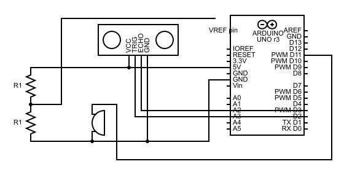

# simple-home-security
An Arduino-based machine that alerts of break-ins using proximity.

## Introduction
Oftentimes when living with multiple people in the same house, there are times when you may not want anyone else to enter your room—especially when you are not there. As such, my main motivation for this was for that purpose: to keep others out of my room. However, while developing the system, I found that it could be easily repurposed into a simple home security system.\
As such, I created a security system with the following goals and features in mind:
* Detect movement at a specified distance and alert the user in some way.
* Play a sound to alert and warn the intruder.
* Change the display of the on-board LED matrix to an appropriate symbol.
* Write a message to the Arduino Serial Monitor whenever movement is detected, _logging the time it happens._

## Circuit
\
Above is a schematic of the circuit required, which is simple and able to be freely modified. The following components are used:
* Arduino Uno R4 WiFi (Uno R3 shown in schematic)
* Ultrasonic Distance Sensor (HC-SR01)
* Piezo Buzzer
* 2x Resistors (Equivalent resistance)
There are three sub-circuits that comprise this system, each with specific functions.
### Ultrasonic Sensor Functionality
The purpose of the ultrasonic sensor is for the system to be able to calculate the distance of an object—or in this case, a person—near it. The Vcc and GND pins are straightforward and can just be plugged into the corresponding Arduino pins.\
"TRIG" or "Trigger" is our input pin. By sending a HIGH signal for at least 10µs, the sensor will emit the ultrasonic wave required for the next step. Since we only need to emit a simple HIGH/LOW signal, Trigger can be connected to any digital I/O pin on the Arduino.\
This is where our output pin, "ECHO", comes into play. When a wave is emitted, it will travel to the nearest object and be reflected off it, returning to the sensor. The Echo pin will be set to HIGH for an amount of time equivalent to the time it takes for the wave to return to the sensor, which will be useful to calculate distance.\
This process can be explained better with a real-life example:\
\
In the diagram above, we see a bat using echolocation. It emits sound waves that then bounce off the nearby butterfly and return to the bat. Because of this, the bat knows not only that there is a butterfly nearby but where it is relative to the bat itself.\
Returning to the sub-circuit, we will need to record the Echo output as a pulse. As such, it must be connected to one of the digital I/O ports with PWM functionality.
### Buzzer
In the simplest terms, a buzzer is an circuit component that will make a noise when given a voltage. The pitch (frequency) and duration of the noise can be controlled if we feed it a wave, which is why it is connected to a digital I/O pin with PWM functionality. The negative end is then connected to ground.
### Voltage Divider
The only purpose of including a voltage divider on this circuit is to provide an appropriate voltage for the Arduino Uno R4's RTC module. The [documentation](https://docs.arduino.cc/tutorials/uno-r4-wifi/rtc/) states that in order to use the RTC functionality, a voltage in the range of 1.6-3.6V must be applied to the VRTC pin on the board. If this is done, the RTC module will continue functioning even when the board is turned off.\
Using the 5V source of the Arduino, we are capable of creating a voltage of 2.5V to feed to VRTC by using any two resistors with the same resistance. Of course, any resistances may work so long as the voltage between them is in the range of 1.6V and 3.6V. A helpful equation might be the Voltage Divider Rule (VDR): \$V_{R_1}=\frac{R_1}{R_1+R_2}$, where \$V_{R_1}$ is the voltage across the first resistor in series. This quantity can then be subtracted from 5V to determine the resulting input voltage to VRTC.

## Code
The Arduino sketch is split into four files:
* `homesecurity.ino`: The bread and butter of the system. Calls relevant functions to initialize system and performs the necessary steps to calculate distance and decide whether to alert user and intruder.
* `connectivity.ino`: Contains all of the code required for the board to connect to the Internet. Used primarily for timekeeping.
* `connectivity.h`: Header file for `connectivity.ino`.
* `network_credentials.h`: Contains definitions for network credentials. Stored in a separate file for convenience and security.
Rather than go through each file individually, I would like to explain all of the code separated by the goals we wish to accomplish, going through them in order of least importance.
### Logging movement with timestamp
RTC modules are readily available for boards that do not have them, but the issue with all of them is that they must be powered at all times to continue counting time. That would prove infeasible for my purposes, so I decided to find a way to reset the time to the current time on every system boot.\
Unfortunately, **this process requires Wi-Fi**, which means it cannot be accomplished on boards that do not support it.\
Once again, the Arduino documentation contains the functions required to connect your board to the Internet and fetch time from a Network Time Protocol (NTP) server.\
`void connectToWifi()` is modified from this source. It checks if there is a Wi-Fi module in the first place, if the firmware is up-to-date, then connects to a WPA/WPA2 Wi-Fi network using the `SSID` and `PASS` environment variables defined in `network_credentials.h`.\
Moving to `homesecurity.ino`, here we define two variables: `WifiUDP Udp`—a UDP instance that allows us to send/receive packets over UDP—and `NTPClient timeClient(Udp)`, which is an NTP client that we will use to fetch the time from the Internet.\
We connect to the Internet, start the RTC, and start the time client:\
```
connectToWifi(); // connect to Wifi
RTC.begin();

// begin the time client
timeClient.begin();
timeClient.update();
```
Then, we obtain the local time in the next few lines and set the RTC's start time to our local time. During our loop, we have a variable `currTime` that stores the current time and is then used in the `Serial.print()` lines whenever we need to print the timestamp an incident occurs. It will look like this:\
`[2024-5-31 18:26:05] Movement detected!`
### Detect movement and alert user
